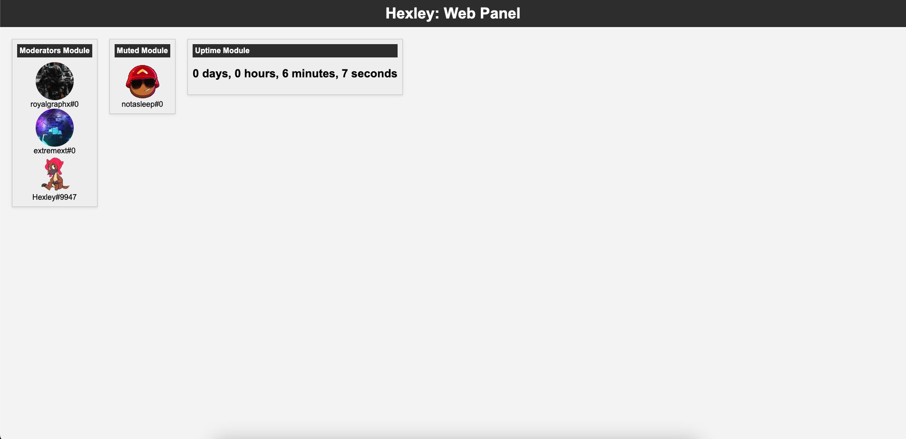

<p align="center">
  
</p>

# Hexley
An Open Source, Modular Discord Bot that is written in NodeJS for Server Management and Enrichment.
<br>
<br>

# Features
</br>
</br>

| Module Name | Purpose | Commands |
| --- | --- | --- |
| autorole | Automatically assigns roles to a user upon joining the server. | None |
| customrp | Allows the user to define custom rich presence. | None |
| decode | Allows a user to decode supported encryptions. | ``/decodebase64 [base64 string]`` |
| encode | Allows a user to encode supported encryptions. | ``/encodehex 0x[0000]``, ``/encodebase64 [plain text]`` |
| help | Displays a help message displaying all supported commands. | ``/help`` |
| interactivecli | Turns the console output into an interactive shell which allows for sending commands in a pseudo terminal. | ``[Channel ID] [Message Content]``, ``stop``, ``stats`` |
| linkfinder | Allows a user to quickly link a URL to someone in a text channel. | ``/link [search]`` |
| moderation | Loads other submodules which allows for easier moderating of public servers. | ``/mute [user]``, ``/unmute [user]`` |
| pcifinder | Allows a user to gather specific information about a PCI device with its vendor/device id | ``/pci [vendor_id] [device_id]`` |
| selfassign | Spawns a dropdown menu message in a specified channel which allows for users to self assign roles. | None |
| time | Allows users to view the current time of other users in the server, specifically for knowing if one is possibly active or not. | ``/settz [City, State, or County]``, ``/time [optional: user]`` |
| verbose | Actively shows messages in ``[Time] [Channel] [User]: [Message]`` format in the console. Does not log any messages. | None |
| web | Spawns a web panel that can display information given by modules. | None |

Hexley also has a web panel! This is a screenshot showing the moderation and uptime module pushing data to the web panel. In the future, more modules will have web panel support, depending on the importance of the modules information.

<p align="center">
  
</p>

Requirements:

main.js vars
```
discord_token=
guildId=
memberRoleId=
```

/modules/selfassign/selfassign.js
```
channelId=
amdRoleId=
intelRoleId=
```

/modules/moderation/moderation.js
```
moderatorRoleId=
mutedRoleId=
```

/modules/time/time.js and /modules/time/tzSetter.js
```
geonamesUsername=
username=

You can register for a free geonames account at https://www.geonames.org/login and don't forget to enable API features.
```

Install dependencies with

``npm install``

run with

```bash
chmod +x run.sh
./run.sh
```

If you run into any issues trying to start the bot, please consider running it with the bare minimum, feel free to comment out almost all the init's and const's. Here is an example of disabled modules:

```js
// Load Modules

const autorole = require('./modules/autorole/autorole');
// const verbose = require('./modules/verbose/verbose');
// const tzSetter = require('./modules/time/tzSetter');
const time = require('./modules/time/time');
const linkfinder = require('./modules/linkfinder/linkfinder');

...

// initiate the modules

autorole.init(client, guildId, memberRoleId);
// verbose.init(client, guildId);
// tzSetter.init(client, guildId);
time.init(client, guildId);
linkfinder.init(client, guildId);
```

In the above example, verbose and tzSetter are not going to load.

Written within a [DarwinKVM](https://github.com/royalgraphx/DarwinKVM) Virtual Machine!

Join the [discord](https://discord.gg/ryQFC8Vk7b) this server lives in!

